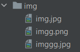

# TALLER 2: DISEÑO Y ESTRUCTURACIÓN DE APLICACIONES DISTRIBUIDAS EN INTERNET

Servidor web que soporta múlltiples solicitudes seguidas (no concurrentes). Lee los archivos del disco local y retornar todos los archivos solicitados, incluyendo páginas html, archivos java script, css e imágenes.

### Prerrequisitos
- Java
- Maven

### Instalación

1. Clonar el repositorio

```
git clone https://github.com/SantiagoBayona/AREP-Lab-02
```

2. Dentro del directorio del proyecto lo construimos

```
mvn package
```

## Ejecución

1. Corremos el servidor

```
mvn exec:java -"Dexec.mainClass"="edu.escuelaing.HttpServer"
```

2. Ingresamos a la página mediante esta URL en un navegador

```
https://localhost:35000
```

## Pruebas

Para probar el servidor debemos solicitarle alguno de los recursos



```
https://localhost:35000/imgg.png
```

Al hacerlo vemos que el recurso solicitado carga en el navegador


## Construido con

* Java
* Maven
* Git
* HTML y JS

## Autor

* **Santiago Bayona**
